<div align="center">

# 🧠 Crosslingual-Safety

**低資源語言對 LLM 的繞過效果**

[開發規格](docs/spec.md) · [共筆連結](https://hackmd.io/cbVTLErNSqqEaPthYLA-oA?both) · [簡報連結](https://docs.google.com/presentation/d/1x9vnJTL8kAYyUjREXigmmUo99D9bzRMVjsp9Ja3rXYs/edit?slide=id.g3f5ba5edabe_1_2083#slide=id.g3f5ba5edabe_1_2083)

</div>

# 🌱 Motivation

由於當前 LLM 都有經過 RLHF，會更符合人類的喜好和閱讀習慣，並且目前研究也顯示英文惡意語句經過跨語言轉換可以提升 ASR，近幾年的研究也有提出新穎的 jailbreak 技術。因此想要結合跨語言與新型 jailbreak 來探討這種利用手法。

# 🎯 Goal

- 將原始英文惡意 prompt 轉換為其他語言測試模型對跨語言安全防禦
  - 其他語言包含中文、爪哇語、緬甸語、世界語等
- 比較不同語言間攻擊的成功率

# 🚀 Getting Started

需求：

- [uv](https://docs.astral.sh/uv/)
- Python 3.11
- ZooLab remote LLM API key

## 安裝

```sh
# uv python manager
curl -LsSf https://astral.sh/uv/install.sh | sh     # macOS/Linux
powershell -ExecutionPolicy ByPass -c "irm https://astral.sh/uv/install.ps1 | iex"  # Windows

# clone repo
git clone https://github.com/SoWiEee/Crosslingual-Safety.git
cd Crosslingual-Safety/

# install runtime, development, and default local translation dependencies
uv sync --all-groups --extra translation-nllb

# optional online translation provider
uv sync --all-groups --extra translation-google
```

從範例 `.env.example` 建立 `.env`，API key 需自行替換：

```dotenv
ZOOLAB_BASE_URL=https://llm-api.zoolab.org/v1
ZOOLAB_API_KEY=sk-replace-with-your-project-key
```

模型名稱、context size、concurrency 與 rate limit 位於
[`configs/models.yaml`](configs/models.yaml)。

## 統一執行介面（推薦）

初次使用只需要一個穩定的四選項命令。先用 dry-run 檢查固定的 case、翻譯、摘要與
victim request 數量；它不會讀取 `.env`、啟動 CUDA/NLLB、呼叫 provider 或建立 `runs/`：

```sh
uv run crosslingual-safety run --source manual --language all --jailbreak none --dry-run
uv run crosslingual-safety run
uv run crosslingual-safety run --source bench --language zh-tw,vi --jailbreak gra,psa
uv run crosslingual-safety run --source manual --language all --jailbreak all --dry-run
```

`--source` 只能是 `manual` 或 `bench`；`--language` 接受 `en`、`zh-tw`、`vi`、`my`、
逗號清單或 `all`；`--jailbreak` 接受 `none`、`gra`、`psa`、逗號清單或 `all`。manual
預設讀取 `prompts/prompt.txt`，來源固定為繁體中文（`zh-tw`）；要改來源請修改版本化的
`configs/run.yaml`，而不是新增 CLI flag。該設定固定使用本機 NLLB、五個 victim model、
same-as-payload wrapper 與 GRA `joker` role；PSA 摘要使用 `ais3/gemma-4-12b`。

每次正式執行會在 `runs/experiments/<run-id>/` 建立一個可恢復的 parent，並以
`children/none/`、`children/gra/`、`children/psa/` 隔離 jailbreak。乾淨的
`results.jsonl` 每行只含 `case_id, source, language, jailbreak, model, status, response`；
失敗行另外含 `error_type` 與 `error_message`。完整 prompt、provider metadata、翻譯與
PSA cache、generation Parquet 和 provenance 僅存於 `audit/` 與 child 目錄。Parent/child
狀態是 `success`、`partial` 或 `failed`；成功兄弟 child 不會因另一 child 失敗而被刪除。

低階工作流仍可用於除錯或自訂設定，包括 `ingest`、`translate`、`build-variants`、
`plan`、`enqueue`、`generate`、`generation-status`、`retry-failed` 與 `manual-run`。

## 資料集處理

已經將原始資料集和翻譯過的資料儲存於 `data/` 底下：

```text
data/raw/MultiJail/MultiJail.csv
data/raw/JBB-Behaviors/data/harmful-behaviors.csv
data/raw/JBB-Behaviors/data/benign-behaviors.csv
data/raw/Harmbench/harmbench_behaviors_text_all.csv
```

驗證 raw snapshot contract 並建立正規化 Parquet：

```sh
uv run crosslingual-safety ingest --repo-root .
uv run crosslingual-safety deduplicate
```

主要輸出位於 `data/normalized/`，包含 cases、source records、原生翻譯、
JBB pairs、variant selection 與 raw snapshot inventory。

## 翻譯與審查

資料集原生翻譯會自動優先於機器翻譯。預設使用本機 GPU 上的
`facebook/nllb-200-distilled-600M` 補齊缺少語言，不需翻譯 API key。
需要 NVIDIA CUDA；首次執行會從 Hugging Face 下載模型並寫入本機 cache：

```sh
# deploy the checkpoint with standard HTTP (avoids hf-xet stalls)
HF_HUB_DISABLE_XET=1 uv run hf download \
  facebook/nllb-200-distilled-600M pytorch_model.bin

# local NLLB is the default translator
uv run crosslingual-safety translate --languages zh,vi,my

uv run crosslingual-safety export-translation-review --output runs/pilot_001/translation_review.csv

# 完成人工審查欄位後再匯入
uv run crosslingual-safety import-translation-review --input runs/pilot_001/translation_review.csv

uv run crosslingual-safety validate-translations
uv run crosslingual-safety freeze-translations --experiment pilot_001
```

Windows PowerShell 的模型部署指令為：

```powershell
$env:HF_HUB_DISABLE_XET = "1"
uv run hf download facebook/nllb-200-distilled-600M pytorch_model.bin
```

NLLB 使用 CUDA FP16、單筆 deterministic decoding，4 GB VRAM 可執行但不提高
batch size。超過模型原生 1024-token 上限的 case 不會截斷，會寫入
`data/translated/translation_failures.jsonl` 並標記為需要人工翻譯。
若要使用免費線上備援，可明確指定
`--translator deep-translator-google`；它使用非官方 web endpoint，可能遇到限流
或上游變更。付費官方 API 則使用 `--translator google-cloud-nmt-v3`。

若只處理 MultiJail 已有的人工翻譯，可改用：

```sh
uv run crosslingual-safety translate \
  --languages zh,jv \
  --translator dataset
```

## 建立 Prompt Variants

`none` 不加入 wrapper。Academic 與 roleplay 目前提供英文、中文模板；
爪哇語與緬甸語 payload 可明確指定英文 wrapper，並標記為 mixed-language。

```sh
uv run crosslingual-safety build-variants \
  --languages en,zh,jv,my \
  --jailbreak none

uv run crosslingual-safety build-variants \
  --languages en,zh \
  --jailbreak academic_authority_v1

uv run crosslingual-safety build-variants \
  --languages jv,my \
  --jailbreak academic_authority_v1 \
  --wrapper-language-mode english

uv run crosslingual-safety build-variants \
  --languages en,zh \
  --jailbreak roleplay_v1

uv run crosslingual-safety build-variants \
  --languages jv,my \
  --jailbreak roleplay_v1 \
  --wrapper-language-mode english
```

不同方法會依 `variant_id` 累加至
`data/variants/prompt_variants.parquet`，不會覆寫既有方法。

## 遠端推論

先確認 [`configs/experiment.yaml`](configs/experiment.yaml) 的資料集、語言、
jailbreak 與模型矩陣，再建立可恢復的 SQLite jobs：

```sh
uv run crosslingual-safety plan \
  --config configs/experiment.yaml

uv run crosslingual-safety enqueue \
  --config configs/experiment.yaml

uv run crosslingual-safety generate \
  --experiment pilot_001

uv run crosslingual-safety generation-status \
  --experiment pilot_001

uv run crosslingual-safety retry-failed \
  --experiment pilot_001 \
  --only retryable
```

`generate` 可安全重跑；成功工作不會再次呼叫 provider。每次 attempt、raw response、
final projection 與 Parquet snapshot 位於 `runs/pilot_001/`。

## 手動單輪批次測試

`manual-run` 可讀取使用者自己的 UTF-8 `.txt` 或 `.jsonl`，使用本機 GPU NLLB
補齊英文、中文、越南語與緬甸語，再將每個語言版本送到預設五個遠端模型。
手動執行的 `max_tokens` 預設為 4096，讓會先產生內部 reasoning tokens 的模型
有足夠額度輸出最終 response；仍可用 `--max-tokens` 明確覆寫。

`.txt` 的整個檔案視為一筆 prompt，必須明確指定來源語言：

```powershell
uv run crosslingual-safety manual-run prompts\prompt.txt `
  --source-language zh
```

使用四語 Paper Summary Attack（執行前會先產生四個語言摘要）：

```powershell
uv run crosslingual-safety manual-run prompts\prompt.txt --source-language zh --jailbreak psa_static_v1 --wrapper-language-mode same-as-payload
```

`--role` 只對 `gra_v1` 生效；`psa_static_v1` 仍保留版本化 YAML sections 作為低階靜態
fallback，但 `manual-run` 會在 victim jobs 前使用相同的 ZooLab endpoint 呼叫
`ais3/gemma-4-12b`，為 `en`、`zh`、`vi`、`my` 各產生一次摘要。摘要成功後會寫入不可變的
`summary_artifacts.jsonl`，第二次相同 contract 的執行會重用四筆 cache。

`.jsonl` 每行是一筆 prompt，不支援 CSV：

```jsonl
{"prompt_id":"p001","prompt":"First prompt","source_language":"en","role":"riddler"}
{"prompt_id":"p002","prompt":"第二個提示","source_language":"zh","role":"lex_luthor","system_prompt":"Optional system prompt"}
```

套用 GRA 時，第一版由使用者選擇 `joker`、`lex_luthor`、`riddler` 或
`scarecrow`。JSONL 每筆的 `role` 優先於 CLI `--role`；未指定時預設
`joker`。GRA wrapper 預設為英文：

```powershell
uv run crosslingual-safety manual-run prompts\prompts.jsonl `
  --jailbreak gra_v1 `
  --role joker `
  --wrapper-language-mode english
```

預設遠端生成模型為：

```text
ais3/llama-3.1-8b
ais3/gemma-4-12b
ais3/gemma-4-26b
ais3/nemotron-cascade-2-30b
ais3/llama-3.3-70b
```

`ais3/llama-guard-3-8b` 是安全分類器，因此不在預設生成矩陣。若要額外加入
`ais3/nemotron-3-ultra-550b`，使用其設定名稱：

```powershell
uv run crosslingual-safety manual-run prompts\prompts.jsonl `
  --add-model nemotron_3_ultra_550b
```

Ultra 550B 使用相同的 `ZOOLAB_BASE_URL` 與 `ZOOLAB_API_KEY`，不需要另一組
credential。其設定預設為 concurrency 1、每分鐘 10 requests、timeout 180 秒。
也可用 `--models` 完全取代預設清單：

```powershell
uv run crosslingual-safety manual-run prompts\prompts.jsonl `
  --models gemma_4_26b,llama33_70b,nemotron_3_ultra_550b
```

輸出位於 `runs/manual/<run-id>/`：

```text
input_snapshot.jsonl
translations.jsonl
variants.jsonl
results.jsonl
report.md
run_manifest.json
```

相同輸入與設定會得到相同 run ID。重跑同一指令時會沿用 SQLite job queue，
已成功的模型呼叫不會再次送出。

## 測試與品質檢查

```sh
# complete test suite
uv run pytest -q

# focused phase tests
uv run pytest tests/test_ingestion.py -q
uv run pytest tests/test_translation.py -q
uv run pytest tests/test_variants.py -q
uv run pytest tests/test_generation.py -q
uv run pytest tests/test_manual.py -q

# formatting, lint, and strict typing
uv run ruff format src tests
uv run ruff check src tests
uv run mypy src
```

# 🛠️ Pipeline

```mermaid
flowchart LR
    %% 階段 1：資料解析與正規化
    RAW["📂 原始資料集\nMultiJail / JBB / HarmBench"] --> INGEST["📥 1. 資料解析與正規化\n`ingest` + `deduplicate`"]
    INGEST --> NORM["📊 正規化資料\n`data/normalized/`\ncases, sources, translations"]

    %% 階段 2：多語言翻譯與審查
    NORM --> TRANSLATE["🌐 2. 多語言翻譯與人工審查\n`translate --languages zh,vi,my`\nNLLB-600M GPU 本機翻譯"]
    TRANSLATE --> REVIEW["👁️ 人工審查循環\n`export-review` → 編輯 → `import-review`"]
    REVIEW --> FREEZE["🔒 凍結翻譯版本\n`freeze-translations`"]
    FREEZE --> FROZEN["📁 凍結後資料\n`data/translated/frozen/`"]

    %% 階段 3：產生 Prompt 變體
    FROZEN --> VARIANTS["🧪 3. 產生 Prompt 變體\n`build-variants --jailbreak <方法>`\n支援: none, academic, roleplay, GRA"]
    VARIANTS --> VAR_OUT["📦 變體資料集\n`data/variants/prompt_variants.parquet`\n累加式不覆寫"]

    %% 階段 4：批次遠端推論實驗
    VAR_OUT --> PLAN["📋 4. 批次實驗規劃\n`plan` → `enqueue`\n依 experiment.yaml 建立任務佇列"]
    PLAN --> GENERATE["🚀 5. 遠端模型推論\n`generate --experiment <id>`\n5 模型並行、可續跑、可重試"]
    GENERATE --> RESULTS["📈 實驗結果\n`runs/<exp>/results.parquet`"]

    %% 階段 5：手動單輪測試
    PROMPT["📝 使用者自訂 Prompt\n`prompts/*.txt` 或 `.jsonl`"] --> MANUAL["🧪 手動單輪測試\n`manual-run --source-language <lang>`\n自動翻譯 4 語言 + 5 模型測試"]
    MANUAL --> MANUAL_OUT["📂 手動測試輸出\n`runs/manual/<run-id>/`\n含報告、翻譯、變體、結果"]

    %% 深色主題配色 - 高對比度、避免淡色背景
    classDef stage1 fill:#1b4332,stroke:#4ade80,stroke-width:2px,color:#e8f5e9
    classDef stage2 fill:#1e3a5f,stroke:#60a5fa,stroke-width:2px,color:#dbeafe
    classDef stage2sub fill:#1e3a5f,stroke:#60a5fa,color:#dbeafe
    classDef stage3 fill:#7c2d12,stroke:#fb923c,stroke-width:2px,color:#ffedd5
    classDef stage4 fill:#781e3f,stroke:#f472b6,stroke-width:2px,color:#fce7f3
    classDef stage5 fill:#4c1d95,stroke:#a78bfa,stroke-width:2px,color:#ede9fe
    classDef io fill:#374151,stroke:#9ca3af,color:#e5e7eb

    class INGEST stage1
    class TRANSLATE stage2
    class REVIEW,FREEZE stage2sub
    class VARIANTS stage3
    class PLAN,GENERATE stage4
    class MANUAL stage5
    class RAW,NORM,FROZEN,VAR_OUT,RESULTS,PROMPT,MANUAL_OUT io
```



---

## Stages Summary

| 階段 | 指令 | 輸入 | 輸出 |
|-------|------|------|------|
| **1. 資料解析** | `ingest` + `deduplicate` | `data/raw/` (MultiJail, JBB, HarmBench) | `data/normalized/` (cases, sources, translations, inventory) |
| **2. 多語言翻譯** | `translate` + 審查循環 | 正規化資料 | `data/translated/frozen/` (NLLB GPU + 人工審查) |
| **3. 產生變體** | `build-variants --jailbreak <方法>` | 凍結翻譯 | `data/variants/prompt_variants.parquet` (累加式) |
| **4. 批次實驗** | `plan` → `enqueue` → `generate` | 變體 + `configs/experiment.yaml` | `runs/<exp>/` (SQLite 佇列、結果、重試) |
| **5. 手動測試** | `manual-run prompts/...` | `prompts/*.txt\|.jsonl` | `runs/manual/<run-id>/` (報告、翻譯、結果) |

---

## Bypass Methods

### GRA: Graph-Based Role-Playing Attack for Single-Turn Jailbreak

- 原始論文見 [GRA_Jailbreak.pdf](refs/GRA_Jailbreak.pdf)
- 運用認知慣性，當模型陷入複雜的結構化分析任務時，會優先考慮任務的合規性，而降低對安全護欄的警覺性。
1. 角色扮演：根據惡意目標（如恐怖主義），從預定義的資料庫（包含 17 個 DC 漫畫反派角色，如小丑 Joker）中動態選擇背景相符的反派角色，建立一致的對抗上下文。
2. 圖注意力重新定向：先讓他做一個無害的學術任務（社交網路關係圖），把模型的運作背景轉移到學術圖論分析
3. 結構化惡意內容編碼：要求模型以同樣的圖論方法處理惡意意圖，並以 JSON 輸出具體的執行步驟

### Paper Summary Attack (PSA)

- 原始論文見 [Paper_Summary_Attacks.pdf](refs/Paper_Summary_Attacks.pdf)
- 利用學術內容的權威性與結構化特徵，建立一個專業的上下文環境，從而降低模型的防禦意識。
- 本專案提供 `psa_static_v1`：以 `refs/GRA_Jailbreak.pdf` 的英文 YAML sections 作為
  唯一 source corpus，並在 manual runtime 以 `ais3/gemma-4-12b` 產生四語摘要；YAML
  sections 仍是低階 renderer fallback/reference corpus。
- 模板保存 `summary_id`、來源 DOI、PSA 參考、六段 section order、插入邊界、語言與
  translation provenance；Attack Scenario Example 是一個邏輯插入邊界，官方 skeleton
  在該邊界內引用 payload 兩次。
- 主要分為三個系統性步驟：
  1. 收集 LLM 安全論文：從網路收集關於 LLM 安全的真實研究論文，並將其分類為「攻擊型」與「防禦型」論文。
  2. 生成模板：使用越獄代理模型為收集到的論文各章節生成摘要，以保留論文的結構與邏輯流，同時避免過於冗長的上下文。
  3. 植入有害 payload：設計一個特定的 payload 區塊來放入有害問題嵌入到論文摘要的特定章節之間

使用 PSA 靜態模板執行手動單輪測試：

```powershell
uv run crosslingual-safety manual-run prompts\prompt.txt --source-language zh --jailbreak psa_static_v1 --wrapper-language-mode same-as-payload
```

`--role` 只套用於 `gra_v1`。PSA 的摘要模型與五個 victim model 共用
`ZOOLAB_BASE_URL`/`ZOOLAB_API_KEY`；credential 不會寫入 artifacts、manifest 或 variant
metadata。summary 失敗時會在建立 variants 與 `jobs.sqlite` 前中止。

# 📘 References

- [HarmBench dataset](https://github.com/centerforaisafety/HarmBench/blob/main/data/behavior_datasets/harmbench_behaviors_text_all.csv)
- [MultiJail dataset](https://huggingface.co/datasets/DAMO-NLP-SG/MultiJail)
- [JBB Behaviors](https://huggingface.co/datasets/JailbreakBench/JBB-Behaviors)
- [Cross-Lingual Jailbreak Detection via Semantic Codebooks](https://arxiv.org/abs/2604.25716v1)
- [Lost in Translation, Found in Evaluation: Multilingual Jailbreak Detection Across 49 Languages](https://ieeexplore.ieee.org/document/11379319)
- [Jailbreak Attack Method for Large Language Models Based on Semantic Space](https://ieeexplore.ieee.org/document/11290523)
- [Paper Summary Attack: Jailbreaking LLMs Through LLM Safety Papers](https://ieeexplore-ieee-org.po.nutn.edu.tw/document/11465062)
- [Transfer Learning And Cross-Linguistic Generalization In Multilingual Hate Speech Detection: Approaches And Challenges](https://ieeexplore.ieee.org/document/11132234)
- [A Fragment-Based Multilingual Jailbreak Testing Framework for Large Language Models](https://ieeexplore.ieee.org/document/11600455)
- [GRA: Graph-Based Role-Playing Attack for Single-Turn Jailbreak](https://ieeexplore.ieee.org/document/11455216)
